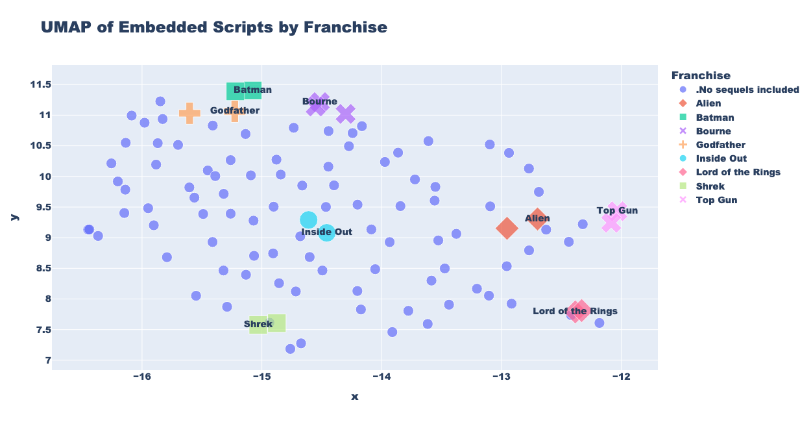
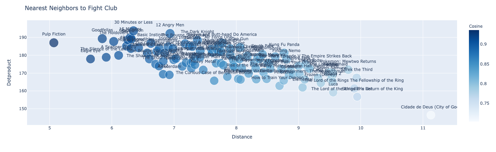

# Vector Search for Visualizing Movie Script Relationships
## Interactive Flask App Visualizations of 3 Combined Movie Datasets

**Topics**
1) Vector Search
2) Embedding Models
3) UMAP
4) NLP Data Cleaning
5) Flask App Deployment

## The Dataset
`data/out/movie-script-dataset.parquet` contains data from 3 sources.
1) Kaggle Movie Scripts Dataset
2) Manually downloading movie scripts from Google search
3) Kaggle IMDB Movie Dataset (for year and genre)

## Embedding
After cleaning the scripts using regex, we feed them into `bge-large-en-v1.5` in chunks, then use mean pool embedding to collapse the (n_chunks, n_tokens, hidden_size) into a single vector of length hidden_size = 1024.

## UMAP
UMAP is a dimension reduction technique that learns a low dimensional projection which preserves equivalent fuzzy topological structure. This is a non-linear alternative to PCA, and is most comparable to t-SNE.

We use it to project the 1024 dimensional embeddings town to 2 dimensions so we can plot them and confirm that similar movies are embedded into similar vectors.

## Visualizations
Visualizations are made with plotly express and hosted on a flask app. 

The main visualization depicts the nearest neighbors (KNN) to a given movie in terms of movie script embedded vector similarity. The y-axis & size are the dot product, which was not as strongly correlated to distance (KNN) as I had expected. The color is the cosine similarity, which is extremely correlated to distance, likely because the embeddings tend to have standard normal values.