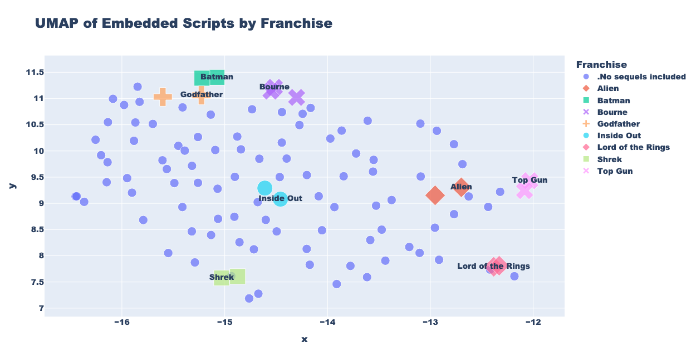
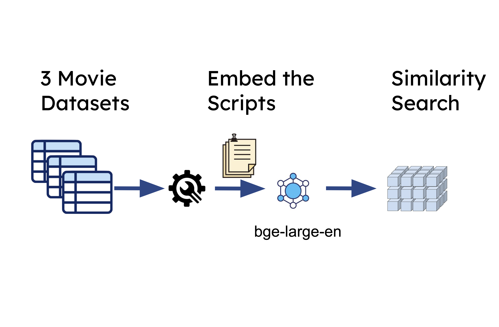
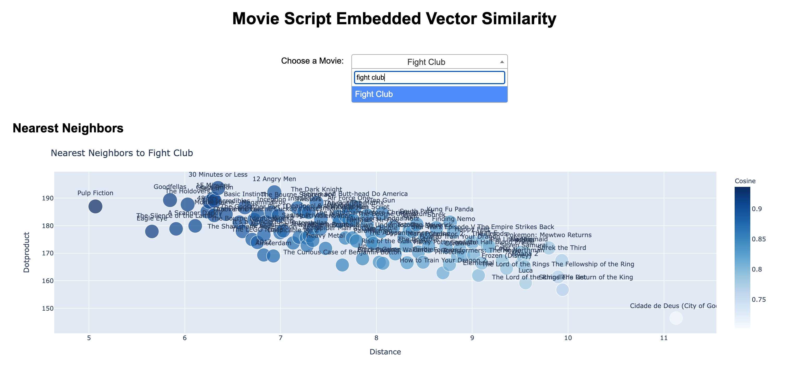
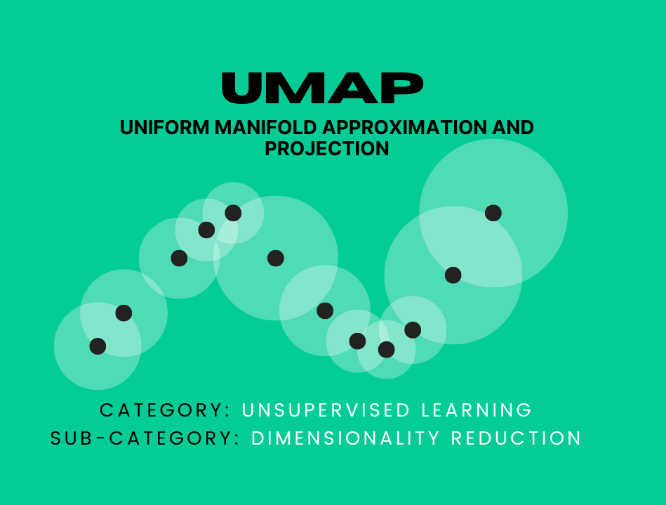

# [Vector Search for Visualizing Movie Script Relationships](tinyurl.com/movie-vector-search)
## [Interactive Flask App Visualizations of 3 Combined Movie Datasets](tinyurl.com/movie-vector-search)

## Project Diagram

### 
&

  

    
  

 

### Vector Search Plot
Visualize 3 vector similarity measures that would commonly be used in vector search.

## The Dataset
`data/out/movie-script-dataset.parquet` contains data from 3 sources.
1) Kaggle Movie Scripts Dataset
2) Manually downloading movie scripts from Google search
3) Kaggle IMDB Movie Dataset (for year and genre)

See the ipynb files for regex data cleaning and polars data joining.

## Embedding
After cleaning the scripts using regex, we feed them into [`bge-large-en-v1.5`](https://huggingface.co/BAAI/bge-large-en)  in chunks, then use mean pool embedding to collapse the (n_chunks, n_tokens, hidden_size) into a single vector of length hidden_size = 1024.

## UMAP
[UMAP](https://umap-learn.readthedocs.io/en/latest/) is a dimension reduction technique that learns a low dimensional projection which preserves equivalent fuzzy topological structure. This is a non-linear alternative to PCA, and is most comparable to t-SNE.

We use it to project the 1024 dimensional embeddings town to 2 dimensions so we can plot them and confirm that similar movies are embedded into similar vectors.

## Visualizations
Visualizations are made with plotly express and hosted on a flask app. 

The visualization titled "Nearest Neighbors to Fight Club" depicts the nearest neighbors (KNN) to a given movie in terms of the embedded vector distance for the movie script. The y-axis & size are the dot product, which was not as strongly correlated to distance (KNN) as I had expected. The color is the cosine similarity, which is extremely correlated to distance, likely because the embeddings have values from the standard normal distribution.

**Notes**

Feel free to reach out at linkedin.com/in/anders-ward/

[tinyurl.com/movie-vector-search](tinyurl.com/movie-vector-search)
